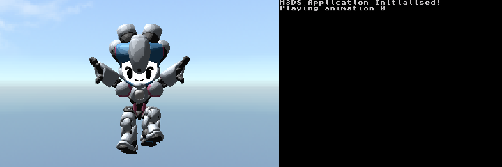
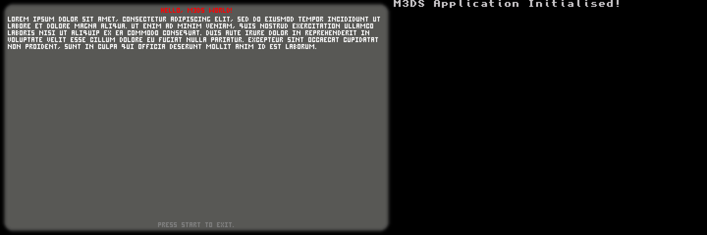

# M3DS Examples

This repository contains a collection of example projects using the M3DS framework to demonstrate basic functionality.

## Build Instructions
1. Clone the repository
2. Open a terminal in the repository folder
3. Run `make` to compile all of the projects. Alternatively, running the `make` in one of the project's directories will compile just that project.

## Skeletal Animations Example

## Text Example
